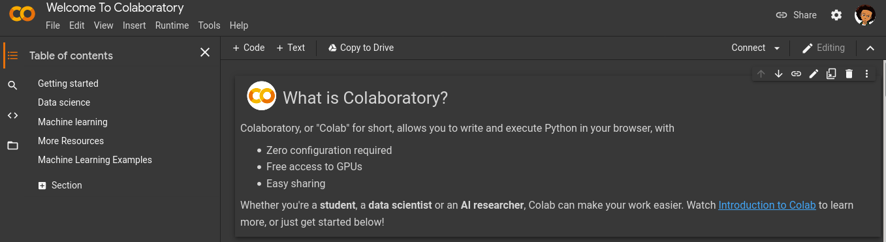

# Day 1
## Introduction to your Tools

### Definitions

__concept__ -  Piece of knowledge the being introduced for the day.\
 __goal__ -  What the concept hopes you will achieve by doing the task.\
 __github__ - An open company allowing users to host their source codes for free and publicly.\
 __google Colabs__ - A free online IDE used by numerous data scientist to write code online.\
 __repository__ - A section in your Github account (you can think of it like a Folder) where you save codes in.\
 __push__ - Sending codes from your computer to your Github account\

#### Today's concept
Data science is made up of numerous skills. Today we will introduce the concepts of cloud coding (on Google Colabs), basic programming and pushing code to Github.

#### Disclaimer
Before continuing the participants should meet the following requirements. In case you do not already have them, use the links attached to be guided.
1. Create an account on Github - https://www.youtube.com/watch?v=f_XsJIHSLRg
2. Have a Gmail account - https://support.google.com/mail/answer/56256?hl=en
3. Have an active internet connection while using Colabs
#### Goal
By the end of this concept, the participant should have practical knowledge on the following:

 1. Starting up a new Google Colab project.
 2. Creating an account on GitHub
 3. Writing your first line of code on Colabs
 4. Committing projects to GitHub directly from Google Colab. 

#### Introduction to Python3 programming
##### Creating a Colab account
To begin writing your first of code, we will begin using an online platform called Google Colab. Google Colab is a free online programming environment which is widely used by data scientist. 
It runs on the cloud (an online server) so you do not have to install anything on your computer. While using Colab, your work is automatically saved to your online cloud space (Google gives this space for free to its users).

##### Task
#### Task 1: Begin a Colabs project

 1. Use the link to access Colabs - https://colab.research.google.com/notebooks/intro.ipynb. **Make sure you are signed into your Gmail account on your computer .** 

 2. In Colabs click on *File -> New Notebook*. You will be navigated to a new tab with a blank notebook. 

#### Task 2: About Colabs
Colabs offers a wide array of functionalities. The participant will be introduced to this concepts as they progress through daily task. 
The features will be be using for this concepts are:

 - **Play Button:** Once the play button is clicked, Colabs will begin running the piece of code you just wrote.

 ##### Action Item
 - Type the following piece of Python3 code in the Colabs cells
 `print('Hello world')`
 If done successfully, you Colabs will look like the image below

- Now click on the play button button to execute the piece of code you just wrote. 
_Note: It might take some time depending on the speed of your internet connection._
*What you just did was write a Python program that puts 'Hello world' on the screen - Yes, you just wrote a Python.*
If done successfully, you Colabs will look like the image below.

*Note, if this is the first time you are doing any of this including writing Hello world, then Congratulations you just wrote your first line of code.*

- **Saving your Notebook:**  Notebooks are automatically saved whenever a change  is made to them. In the case where you have many notebooks (like we will for the next 99 Days), we will have to give memorable names that represent the project you are working on. For this project will call it _**Day 1 - Introduction**_. 
To rename your Notebook, on the top left corner of the screen you will see the text labeled **"Untitled0.ipynb"**.
##### Action Item
- Click on the label **"Untitled0.ipynb"**, and type _**Day 1 - Introduction.ipynb**_
- Press Enter to rename the file
If done successfully, your Colabs Notebook Title will look like the image below.

#### Task 3:  Committing to GitHub:
- **Creating a repository and push to it from Colabs:**  For the 100 Days you will make copies of your work save directly to your GitHub account. This is the account we assume you have created by following the tutorial in **Disclaimer #1** above.
##### Action Items
- Go to https://github.com. If you are not signed into your GitHub (the one you just created, or an older one if you had already done so). Then on the top right corner of the site, click on your profile image (or the template picture in its place), then select "Your profile". Scroll to the bottom and you should see a graph. It should look like the image attached.

You may notice a single green dot on the screen or multiple dots. Those are your commits (whenever you push code to GitHub it is called a commit). For each day you push code to GitHub, you are given a green-dot for the day. We will be using this to track your progress. The first green dot or any green dot you see against today is because you just created a new account.
- To create repositories, click on the **+** sign on the top right corner of the screen (close to your profile image). When the drop down menu appears, click "New repository".
If done successfully, you should have a screen like below.

- In "Repository Name", fill in the name **_WTM/GDG Bambili 100 Days of Code Datascience_**. 
- In the "Description", fill in what you hope to achieve by the end of the program. Then click on Public in the next input fields.
- Click on "Add a README file" and finally choose create repository.
Congratulations you have now created your first GitHub respository. Now anytime you want to make changes for each of the days to you will push the code to your repository.

##### Pushing your code to GitHub.
##### Action Items
- Now to make your first 100 Days of Code, Data science commit, 
Go to your Colabs project, select File -> Save a copy in GitHub. If you screen looks like the image below, click on the preferences button (inside the yellow bar) and click "Allow...".
If done successfully, you should have a screen like below.

Scroll to the bottom and select "Authorize googlecolab".
If done successfully, you should have a screen like below.

In the parts that says repository, click on the text underneath it. Select the name of the new repository you just created and click "ok".
- To see your code changes, go to https://github.com/profile. Now click on the name of the repository you just pushed to. You will be presented with files. Click on the file ending with ".ipynb" and you should see the source code you just wrote.
Congratulations you just pushed your first code to GitHub - Well done!!

**Conclusion**
Congratulations if you have made it this far!!
1. Created a new Colabs project
2. Written your first line of code on Colabs
3. Publicly shared your Colabs progress on your Github Account.
With this knowledge you are able to use the code contribution methods used by most data scientist. You can edit your codebase and continue pushing to Github and seeing the changes.

