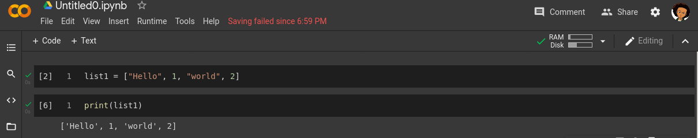
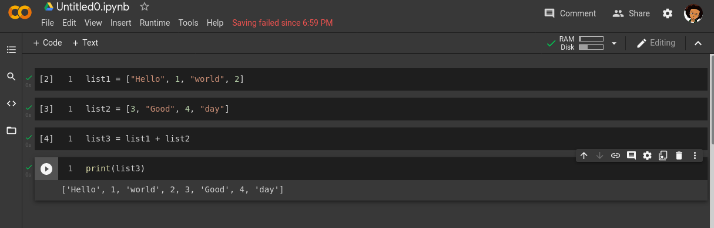


# Day 4
## Introduction to your Tools

### Definitions

__concept__ -  Piece of knowledge the being introduced for the day.\
 __goal__ -  What the concept hopes you will achieve by doing the task.\
 __github__ - An open company allowing users to host their source codes for free and publicly.\
 __google Colabs__ - A free online IDE used by numerous data scientist to write code online.\
 __repository__ - A section in your Github account (you can think of it like a Folder) where you save codes in.\
 __push__ - Sending codes from your computer to your Github account\

#### Today's concept
Today we will introduce the participants to concepts of list and how it differs from Arrays  in Python3. 

#### Disclaimer
Before continuing the participants should meet the following requirements. In case you do not already have them, use the links attached to be guided.
1. Create an account on Github - https://www.youtube.com/watch?v=f_XsJIHSLRg
2. Have a Colabs account
3. Have an active internet connection while using Colabs

#### Goal
By the end of this concept, the participant should be able combine multiple data types into a new data type called a list. This allows participants combine multiple data types from data sources into a single unit.

 1. Returning to a Colabs projects.
 2. Writing more lines of code on Colabs.
 3. Committing projects to GitHub directly from Google Colab. 

#### Task 1: What's the differentiates a list from an Array
In programming languages like C, C++ and Java, there exist a datatype called Arrays. An array is a collection of similar data types into a new data type. For example an Array of Strings will be **{"Hello", "world", "this", "is", "an", "array", "of", "strings"}**. Important rule is Arrays must contain only the same data types. This means mixing up data types into an Array would lead to an error being thrown. \
\

A list as introduced in Python  is like an Array but with the ability to hold multiple data types. For example a sample list in Python will look like **{"Hello", "world", 1, 2, 3, 7.0}**. The ability for a list to store multiple data types makes Python a unique language for data scientist. See a sample list created below: \

\
Must data set collect data of multiple types (qualitative and quantitative), which each row being a single respondent and might need to be treated as a single unit. In other programming languages, custom data types would have to be created to contain said row, but with Python all the data can be contained in a single list for each row. \
\
Knowing the difference between an Array and a list comes in handy when dealing with multiple programming languages which is common among data scientist. \
\
To declare a list in Python, create the var and assign the value beginning and ending with **[** and **]** respectively. For each Item contain in the square brackets separate them with commas (,). You can try the example below and if done successfully your output would look the same as the image below. \
 \

##### Action Item
- Create a list called _list1_ containing 5 strings, 5 floats and 4 integers of your choosing.
- On a new cell, create var called _var1_ and assign it the value of `"Hello" + " world"`. Add _var1_ to _list1_.
- On a new cell, create a list called _list4_ containing 5 Integers, 6 floats and 4 Strings of your choosing.

List in Python can be manipulated with the `+` operator as many of data types in Python. The most common use of `+` operator in Python is to merge 2 or more list into one. For example: \
`list1 = ["Hello", 1, "world", 2]` \
`list2 = [3, "Good", 4, "day"]` \
`list3 = list1 + list2` \
When we output the value of `list3` we will get the following output. \
`["Hello", 1, "world", 2, 3, "Good", 4, "day"]` \
 \
\
##### Action Item
- On a new cell create a new var called _list5_ and assign the value of _list1_ and _list4_.

##### Action Item (for those already used to the concepts of list and other Python methods)
- Create a list called _list2_ with the following inputs: 5, 6, 7.0, "Eight", "Nine"
- Create another list called _list3_ and it's values are the data types of each item in _list2_. The values should not be manually typed but should be generated based on the values of _list2_. This means if _list2_ is changed your method at _list3_ would still remain valid. That means the 0th item of _list3_ is the data type o the 0th item of _list2_. Your data type should be one of the following: \
- - Integer
- - String
- - Float

#### Task 2: Push your code to GitHub
Based on the previous concepts, you can go ahead and push your work to GitHub.

**Conclusion**
If you have made this far, Congratulations!!
- You are able to group different data types in to a single variable
- You know the difference between an Array and a List
- **If you did the advanced task**, you can run data validation on your list which will become a very needed skill for  a data scientist.

