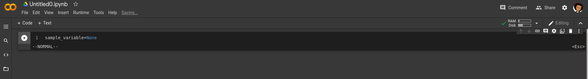
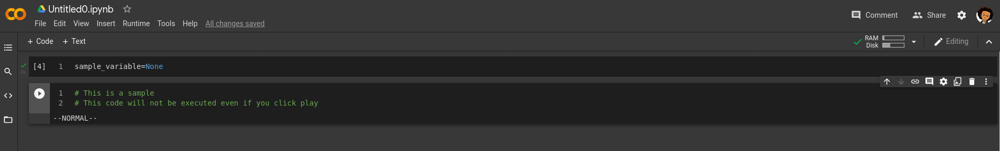
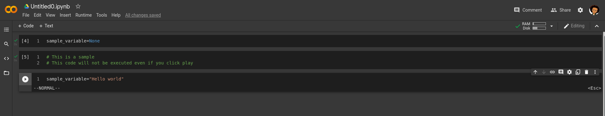
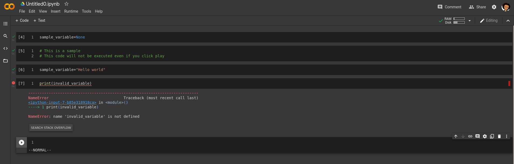
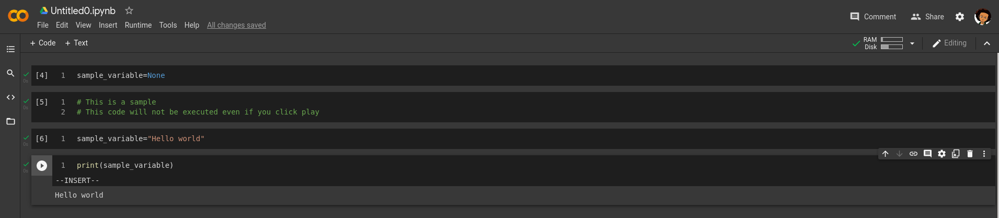


# Day 2
## Introduction to your Tools

### Definitions

__concept__ -  Piece of knowledge the being introduced for the day.\
 __goal__ -  What the concept hopes you will achieve by doing the task.\
 __github__ - An open company allowing users to host their source codes for free and publicly.\
 __google Colabs__ - A free online IDE used by numerous data scientist to write code online.\
 __repository__ - A section in your Github account (you can think of it like a Folder) where you save codes in.\
 __push__ - Sending codes from your computer to your Github account\

#### Today's concept
Today we will introduce the participants to the naming conventions used by programming languages. We will further work on creating a simple program with Python3. 

#### Disclaimer
Before continuing the participants should meet the following requirements. In case you do not already have them, use the links attached to be guided.
1. Create an account on Github - https://www.youtube.com/watch?v=f_XsJIHSLRg
2. Have a Colabs account
3. Have an active internet connection while using Colabs

#### Goal
By the end of this concept, the participant should be aware of concepts as variables, data types and how to use them.

 1. Returning to a Colabs projects. \
 2. Writing more lines of code on Colabs \
 3. Committing projects to GitHub directly from Google Colab.  \

#### Task 1: Accessing Colabs
Your Colabs are stored automatically on the cloud. This means every change you make will be stored online and whenever you return to it you will be able to continue from where you ended. You can revisit you colabs by going to https://colabs.research.google.com. 
##### Action item
- Go to colabs and click on the project you created in Day 1 concept to continue using it

#### Task 2: Writing a program that takes input with Python3
As a data scientist, understand the naming conventions of the tools you use are very important for you daily work. Most tools are defined by the naming conventions and you will be left lost in such as situation of you are not knowledge on your tools. Here are some general coding naming conventions you will begin seeing from now on.
- **Variables**
We all have heard of RAM on the computer. For most people, when the RAM is small the computer becomes slow and faster when more RAM is added. RAM stands for Random Access Memory. When you boot up your computer, all the icons and text you see are coming from the RAM. Each icon is a picture and as such takes up space on the RAM (that is why when the RAM is small the computer takes long to start or load icons). Also when you watch a video it plays from the RAM of your computer that is why when the RAM is small videos begin lagging.\
In programming you store your programs directly on the RAM whenever you run them, but in other to do that you need to understand how to ask the computer for the space you need. This are called variables. When you create a variable you tell the computer to keep some space for you. This space is dynamic which means the computer knows you are about to store something but it does not know how big it is. That is why you can declare empty variables (when you create a variable it is known as declaring a variable). \
Variables can be named with letters of the alphabet, numbers (though do not begin the name of a variable with a number) and some symbols (symbols mostly used are the underscore (_)).
- **Data Types**
When you declare variables they do not hold any data and as such do not consume space on the RAM. To make a variable consume data you have to provide it the data you need for storage. Based on the type and size of data, it will determine how much space is consumed on the RAM. For example, if your variable holds 2MB of data, that is 2MB consumption on the RAM. As a data scientist there are occasions where you may need to hold data up to and more than 10 GB on the RAM. This will not be possible if your system does not have at least 10 GB of RAM. This are extreme cases though and rarely would you be in such situations. \
**Fun fact:** _RAMs can easily be purchased and upgraded on a computer. Most RAMS are relatively cheap_

- **Bringing Variables and Data Types**
##### Action Item 
**creating a variable:**
- Type `sample_variable=None` and click the play button.\
If done successfully you screen should look like that below.
You just declared your first empty variable. _sample_variable_ is the name of the variable. The = is how you assign a data type to your variable. _None_ Means there is no data to be stored in _sample_variable_ (it is an empty variable). \

- Create more variables _sample_variable_ to other names, find out what name can work and which names create an error. For example variables beginning with - will create an error. Using comments (comments are notes you put in your code, they are mostly reminders you put). To create a new comment in Python start the line with a # symbol. Comment 5 types of variable names that do not work in a new cell. If done successfully, you should have the same output as the image below. To know if your variable name is valid or not, enter the variable name in a cell and click play. If it is not valid, you will have an output in red. \

**declaring a data type in a variable:**
- On a new cell, Type `sample_variable="Hello world"` and click the play button. \
If done successfully you screen should look like that below.
You have assigned a value to the _sample_variable_ which means the variable now consumes space on the RAM. The consumption amount is based on the size of the data type. (In this case ~88 bytes). 
Data types that begin with " like in "Hello world" are known as **strings**.
Data types that begin are whole numbers are known as **integers** e.g _sample_variable=1_
Data types that have decimal places as known as **floats** e.g _sample_variable=1.002_

- **Issues you may face with Colabs**
> Making changes without clicking the play button does not update the project and would lead to an error like that below.

#### Task 3: Outputting the values of a variable
The same way a data type can directly be printed to the output, for example outputting 'Hello world' when the play button is clicked on a `print("hello world")` you can also print out the contents of a variable by placing the variable in a print statement. Data visualization for a data science is vital for analysis, as such knowing the various way to output data to check for validity is very important.
##### Action Items
- On a new cell, Type `print(sample_variable)` and click the play button. \
If done successfully you screen should look like that below.

#### Task 4: Push your work to GitHub
Based on the concept of Day 1, the participant should know how to push their work to GitHub. In case you are still not familiar with how this is done, please refer back the concept of Day 1.

#### Conclusion
If you have made it this far, congratulations!! \
- You are able to define the relationship between a variable and the RAM \
- Recognize the different data types when they are presented
- See the output from your variable

**Fun fact:** Some programming languages support the concept of garbage collection. This is when variables are changed back to 'None' by the programming language to stop ended programs for continuing to consume RAM. Languages like C and C++ do not support this, so the programmer is responsible to clearing used variable spaces.

