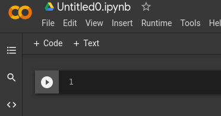
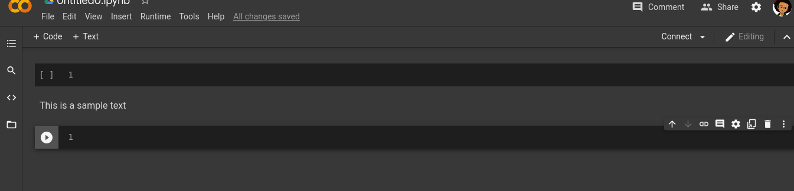


# Day 3
## Introduction to your Tools

### Definitions

__concept__ -  Piece of knowledge the being introduced for the day.\
 __goal__ -  What the concept hopes you will achieve by doing the task.\
 __github__ - An open company allowing users to host their source codes for free and publicly.\
 __google Colabs__ - A free online IDE used by numerous data scientist to write code online.\
 __repository__ - A section in your Github account (you can think of it like a Folder) where you save codes in.\
 __push__ - Sending codes from your computer to your Github account\

#### Today's concept
Today we will introduce the participants to processing using Python and also a brief overview of how processing works at the CPU level. 

#### Disclaimer
Before continuing the participants should meet the following requirements. In case you do not already have them, use the links attached to be guided.
1. Create an account on Github - https://www.youtube.com/watch?v=f_XsJIHSLRg
2. Have a Colabs account
3. Have an active internet connection while using Colabs

#### Goal
By the end of this concept, the participant should be aware of concepts such as the rule CPU plays in programming, identifying the types of CPUs and doing some basic CPU task with Python. The participant will also learn how to do some basic arithmetic using the Python3.

 1. Returning to a Colabs projects.
 2. Writing more lines of code on Colabs.
 3. Committing projects to GitHub directly from Google Colab. 

#### Task 1: Understanding how processing works in Python
Computers were created for the sole reasons of performing complex mathematical operations that would not have been feasibly done by a human person. \
**_Great read:_** https://www.history.com/news/human-computers-women-at-nasa \
This ability of computers is what allows data scientist to compute huge amounts of data in complex activities such as machine learning and other form of analysis. \
In the last concept we saw that when it came to assigning data types to variables we rely heavily on the RAM. \
Now when it comes to performing calculations and other forms of data manipulations we rely heavily on the CPU. \
Every time a user does any form of computation on the computer, they rely on the CPU. For example, when you move the mouse a complex algorithm is used to map the location of the pointer on the screen while maintaining communications with the physical mouse. This is all done on the CPU which is why when the CPU is overworked (doing too many heavy things at once) events turn to happen way after the command has been sent. In some cases all the previous commands requested such as dragging an icon or deleting a file will be done almost all at once way after the original request was made. \
When performing activities in Python such as mathematical operations or searching for files on the computer the CPU is being consumed. \
CPU is measured in frequency (GHz) which relates to how fast the programs can be executed on the computer. Modern computers come with more than 1 CPU installed; computers with 2 CPUs are called Dual Core, computers with 4 CPUs are called Quad Core. Computers go all the way up to 32 CPUs mostly used by big industrial units. \
When it comes to extremely large data sets we will begin relying on the GPU (Graphical Processing Unit). \

#### Follow along examples (you are expected to type this in your colabs and get the required outputs)
1. We begin with a basic form of processing, that is the "Hello world" of mathematics (1+1) \
To perform a simple 1+1 calculation in python; \
`answer = 1 + 1` \
The value of answer is now assigned to `2`. \ 
To verify this you can output the value of answer by doing; \
`print(answer)` \

In the line of code above the `+` symbol is called an operator. Operators are symbols used by the programming language to perform processing. Another example of an operator is `=`.

**Non-exhaustive list of operators and their functions in Python3**
- `+` = used for additions and joining 2 or more things
- `-` = used for subtractions
- `*` = used for multiplications
- `/` = used for divisions
For the actions items following, more operators will be required than those on this list. The participant is expected to do some research with tools such as Google to figure out what the operators they will need are. This is as a means of encouraging further research among the participants.

##### Action Items
_Colabs tip: You can create a new cell by holding down the **Shift** key and pressing the **Enter** key_
- Create a variable called _var1_ and assign the value of **2+2**, then print out the variable.
- Write a comment about the data type assigned to the _var1_.
- On a new cell create a variable called _var2_ and assign the value of **3+2/5**, then print out the variable.
- Write a comment about the data type assigned to the _var2_.
- On a new cell create a variable called _var3_ and assign the value of **4** multiplied by **16**, then print out the variable.
- Write a comment about the data type assigned to the _var3_.
- On a new cell create a variable called _var4_ and assign the value of **4** raised to the power of **6**, then print out the variable.
- Write a comment about the data type assigned to the _var4_
- On a new cell create a variable called _var5_ and assign the value of `'Hello' + ' ' + 'world'`, then print out the variable.
- Write a comment about the data type assigned to the _var5_
- On a new cell create a variable called _var6_ and assign the value of `'Hello world` multiplied by 5, then print out the variable.
- Write a comment about the data type assigned to the _var6_
- On a new cell create a variable called _var7_ and assign the value of **4** mod (modulo) **3**, then print out the variable.
- Write a comment about the data type assigned to the _var7_

#### Task 2: Creating a better presentation with Colabs
Source code can be difficult to read at times. Without a lot of practice it might take one so much time to get down to the actual functionalities a piece of code is highlighting. Data scientist do not write code as the daily software engineer will do; a data scientist is interested in getting results from data and that might sometimes be met with using new methods of using code. \
In other to make sure this does not happen often Colabs integrated a section called text. This allows users to add a text description about their code. \
You can find text on the top left side of the screen written as `+ Text` close to the alternative `+ Code`. \
 \
When text is clicked, a new text cell is created and the user can type in plain text and perform other forms of formatting on the text.  \
 \
Experiment with this feature then go ahead to do the action items.
##### Action Items
- For the cells containing _var1_, _var2_,  _var3_,  _var4_, _var5_, _var6_ and _var7_, create a new text under each of the cells. Insert a description of what is happening in each of the cells.

#### Task 3: Push your work to GitHub
Based on the concept of Day 1, the participant should know how to push their work to GitHub. In case you are still not familiar with how this is done, please refer back the concept of Day 1.

**Conclusion**
If you have made this far, Congratulations!!
- You are able to perform simple calculations using Python
- You are able to verify the values of your calculations using Python outputs
- You are better aware of the relationship between your code and your CPU

