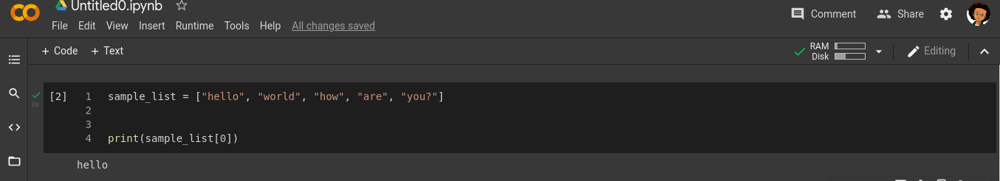
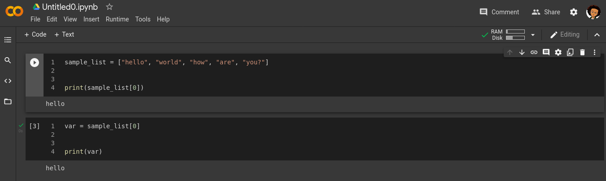
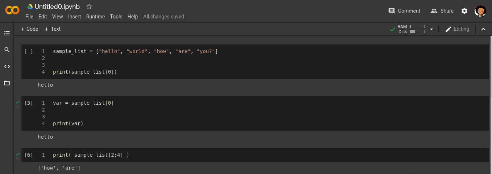
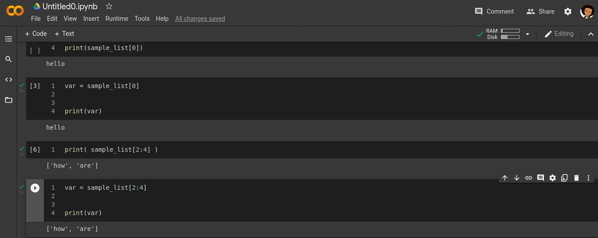


# Day 5
## Introduction to your Tools

### Definitions

__concept__ -  Piece of knowledge the being introduced for the day.\
 __goal__ -  What the concept hopes you will achieve by doing the task.\
 __github__ - An open company allowing users to host their source codes for free and publicly.\
 __google Colabs__ - A free online IDE used by numerous data scientist to write code online.\
 __repository__ - A section in your Github account (you can think of it like a Folder) where you save codes in.\
 __push__ - Sending codes from your computer to your Github account\

#### Today's concept
Today we will introduce the participants to concepts of list and how it differs from Arrays  in Python3. 

#### Disclaimer
Before continuing the participants should meet the following requirements. In case you do not already have them, use the links attached to be guided.
1. Create an account on Github - https://www.youtube.com/watch?v=f_XsJIHSLRg
2. Have a Colabs account
3. Have an active internet connection while using Colabs

#### Goal
By the end of this concept, the participant should be able to navigate a list using the positions of each of it's elements. 

 1. Returning to a Colabs projects.
 2. Writing more lines of code on Colabs.
 3. Committing projects to GitHub directly from Google Colab. 

#### Task 1: Accessing elements in list using their indexes
In programming counting begins from 0 ( yes Zero )! The first item on any list is located at 0. \
Items in a list are called **elements**. \
To access only a single item in a list, you need to know where it is located. \
The location of a element in a list is known as the **index**. \
For example in the list `sample_list = ["hello", "world", "how", "are", "you?"]`, the `"hello"` is located at index 0 (because it is the first element) and `"world"` is located at index 1. \
 \
The elements from a list can be assigned to variables or used in other list. For example, to assign the third element in the list above we do: \
`var = sample_list[0]` and print the output of `var`, we get: \
`print(var) // output = "hello"`.

Multiple elements can be assessed using a range. Ranges are separated by colons (:). The value before the colon (start value) is where to begin and the value after the colon (end value) is where to end. The range begins on the start value and ends before the end value. See an example of a ranged access below. \

You can assign the value of the ranged output to another list variable as shown below. \

##### Action Item
- Create a list called _listIndex1_ and fill it with even numbers from 1 to 10.
- Print the 1st element in _listIndex1_.
- Print the 9th element in _listIndex1_.
- On a new cell, Create a new var called _var1_ and assign it 5th value of _listIndex1_.
- Using Colabs text, explain what happens when we try to access the 12th element in _listIndex1_.
- On a new cell, create a new list called _listIndex2_ and assign it the 4th, 5th and 6th items of _listIndex1_ using. Do this with a single line of code using ranged indexes.

#### Task 2: Push your code to GitHub
Based on the previous concepts, you can go ahead and push your work to GitHub.

**Conclusion**
If you have made this far, Congratulations!!
- You are able to access elements from list using their index
- You are able to assign the elements of a list to variable
- You are able to assign a ranged value from a list to another list

